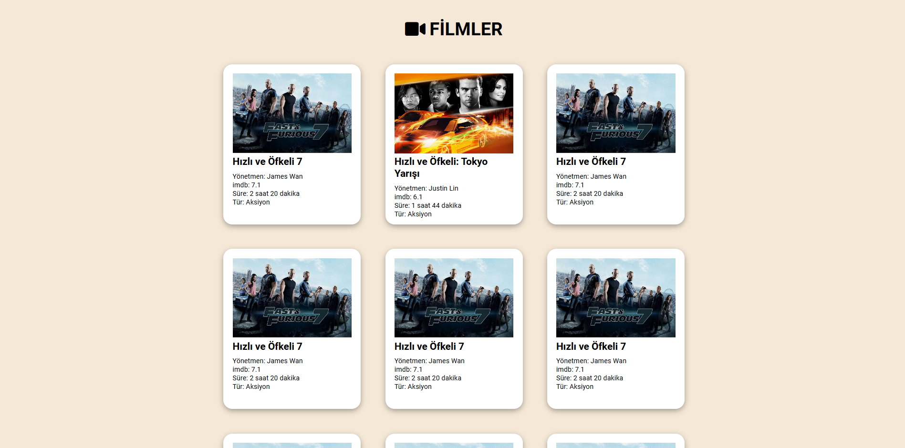

# Hafta 4

**Amaç :** Geçtiğimiz haftalarda öğrendiğimiz bilgileri pekiştirmek için küçük bir film kartları uygulması yaptık.

**Yazarlar :** [**semaozkan**](https://github.com/semaozkan)

## Film Kartları Uygulaması

 

    

---

### Kullandığımız Kaynaklar

**Fonts :** https://fonts.google.com/  
**İcons :** https://fontawesome.com/icon  
**İkonları projeye import etmek için :** https://cdnjs.com/libraries/font-awesome  
**Flex Alıştırması için oyun :** https://flexboxfroggy.com/

---
