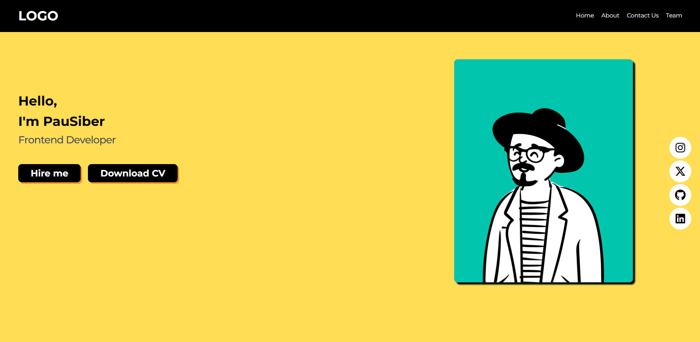

# Workshop

**Amaç :** Geçtiğimiz haftalarda öğrendiğimiz bilgilerin neredeyse tamamını kullanarak basit bir portfolyo sitesi hazırladık.

**Yazarlar :** [**semanurozkan**](https://github.com/semaozkan)

## Portfolyo Tasarımı

 

    

---

### Kullandığımız Kaynaklar

**Fonts :** https://fonts.google.com/  
**Icons :** https://fontawesome.com/icon  
**İkonları projeye import etmek için :** https://cdnjs.com/libraries/font-awesome  
**Projeyi deploy etmek için:** https://vercel.com/

---
