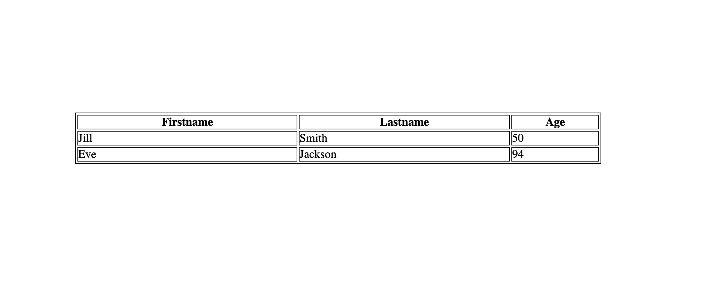

# Hafta 1

**Amaç :** Front-end'in ne olduğunu, HTML ve CSS kavramlarını öğreneceğiz. Sonrasında en temel HTML etiketlerinin ne olduğunu ve bunları stillendirmeyi öğreneceğiz.

**Yazarlar :** [**hazalsilayaprak**](https://github.com/hazalsilayaprak) **&&** [**aykutsahinler**](https://github.com/aykutsahinler)

---

## HTML(Hyper Text Markup Language) Nedir?
HTML bir programlama dili değildir. Aslında Microsoft Word gibi belgeleri düzenleme ve biçimlendirmeye yarar. Arama motorlarına web sitesi hakkında bilgi verir. Web sayfalarının hazırlanmasını sağlar.

#### HTML neler sunar?

Görsel, yazı gibi şeylerin web sitesine yerleştirilmesini sağlar.


### HTML Tag'leri

### `<html>`
Tüm tagleri saran kodlamanın **html** kodları ile yapılması gerektiğini ifade eden başlatıcı tagdir.

```html
<!DOCTYPE html>
<html>
  <head>
    <meta charset="utf-8">
    <title>Page Title</title>
    <link rel="stylesheet" href="style.css">
  </head>
  <body>
    <h1>Welcome to PAUSIBER</h1>
    <p>Follow us instagram and twitter</p>
  </body>
</html>
```

<p align="center">
	
</p>

### `<head>`
`<head>` etiketi tarayıcıya web sitesi hakkındaki bilgileri barındıran etikettir. Bu alanda yer alan kodlar sitede görünmez.

#### `<head>` etiketinin içine yazılan etiketler nelerdir?

##### `<meta>`
Sayfamızın açıklama, anahtar kelimeler, sayfa yazarı, son değiştirilme tarihi gibi bilgilerin bulunduğu kısımdır.

##### `<script>`
Sayfamızda JS yazabilmemizi sağlayan etikettir.

##### `<noscript>`
Kullanıcı tarayıcısında JS çalıştırılmasını engellediyse bu etiket içine yazılan uyarı mesajı ile JS kullanımını açın gibi mesajlar gösterilebilir.

##### `<title>`
Sayfanın tarayıcı sekmesinde yazan başlığı, ismidir.

##### `<style>`
Sayfamızda CSS yazabilmemizi sağlayan etikettir. Sayfamızı stillendirir.

##### `<link>`
Sayfamıza dışarıdan bir dosya dahil etmek istiyorsak bu etiket içine yazarız.

### `<body>`
`<head>` etiketinden farklı olarak <body> içine yazılan bütün etiketler sitede görünür. Kısaca sayfanın görünen kısmını oluşturur.

#### `<body>` etiketinin içine yazılan başlıca etiketler nelerdir?

#### `<p>`
Sayfada bulunan paragarflar, cümleler, kısaca yazıların yazıldığı etikettir.

#### `<h1>, <h2>, ... ,<h6>`
Sayfamızda başlık olarak geçen yazıları temsil eder. Önem sırasına göre h1 den h6 ya kadar gider.

#### `<a>`
Bir resim, yazı ya da herhangi bir şeye tıklandığında başka bir yere yönlendirmek istediğimizde <a> etiketini kullanırız.

#### ``
Sayfamıza resim eklememizi sağlayan etikettir.

#### `<iframe>`
Bir sayfanın içerisine farklı bir internet sayfasını çağırıp, görüntülemenize yardımcı olan bir HTML etiketidir.

#### `<br>`
Sayfamızda satır atlatmak için kullanılan etikettir.

#### `<hr>`
Sayfamıza çizgi çizmek için kullanılan etikettir.

#### `<ul>, <ol>`
Bir listenin var olduğunu belirten etikettir.

##### `<li>`
Listenin elemanlarının yazıldığı etikettir.


#### `<div>` !!
Sayfamızda sanal bir kutu oluşturduğumuz etikettir.

#### `<table>`
<p align="center">
	
</p>

```html
<table style="width:50%">
<tr>
<th>Firstname</th>
<th>Lastname</th>
<th>Age</th>
</tr>
<tr>
<td>Jill</td>
<td>Smith</td>
<td>50</td>
</tr>
<tr>
<td>Eve</td>
<td>Jackson</td>
<td>94</td>
</tr>
</table>
```
```CSS
table, th, td {
  border: 1px solid black;
}
```
#### `<form>`
<p align="center">
	
</p>

## CSS Nedir?
"Cascading Style Sheets" in kısaltmasıdır. Sitemizde var olan HTML etiketlerini şekillendirmemize olanak sağlayan dildir.

### HTML elementlerine neden class verilir?

HTML taglarından istediğimiz olana erişebilmek için class verilir.

### Id ile class arasındaki fark nedir?

Id tektir, bir kere kullanılır. Class birçok etikette kullanılabilir.

### CSS nasıl yazılır?

#### HTML etiketinin içinde stil belirtme

Etiketin içine style="" yazdığımız anda " " içine yazılacak bütün CSS kodları o etikete ait olur.

```html
<div class="box" style="width: 200px; height: 200px; background-color: #ddd;"></div>
```

#### HTML sayfasında CSS yazmak

HTML sayfamızda `<head>` elementlerinin arasında `<style>` elementi kullanarak stiller yaratmamız mümkündür.

```html
<!DOCTYPE html>
<html lang="en" dir="ltr">

<head>
    <meta charset="utf-8">
    <title>hafta1</title>
    <style>
        .box {
            width: 200px;
            height: 200px;
            background-color: #ddd;
        }
    </style>
</head>

<body>
    <div class="box"></div>
</body>
```

#### Stilleri CSS dosyasından çağırmak

Herhangi bir not alma uygulamasından (atom, sublime, notepad++, not defteri) CSS kod yapısına uygun bir şekilde yazılır ve kaydedilir daha sonra HTML dosyamızda <head> etiketi arasına <link> etiketi açılı ve href="" kısmına CSS dosyamızın uzantısı eklenir.

#### CSS'te flex nedir?

Flex sitenin yapısının şekillendirme özelliğidir. Site içerisindeki araçları yatay ve dikeyde kolaylıkla düzenlemek ve hizalamak için kullanılabilecek en iyi CSS yöntemidir.

#### Flex kullanımı nasıldır?

Flex, bir kapsayıcı eleman niteliğindedir ve elemana ait iç elemanlarla etkileşim halindedir. Flex display özelliğinin parametresi şeklinde kullanılır. Flex'i uygulayabilmek için bir tane kapsayıcı eleman ve ona ait iç elemanlarımız olması gereklidir. Kapsayıcı elemana display: flex özelliği verildiğinde kullanıma hazır olur.

---

## Bu hafta neler yaptık ?
'Front-end nedir?' öğrendik.

'HTML nedir?' öğrendik.

'CSS nedir?' öğrendik.

**Haftaya Görüşmek Üzere!**
