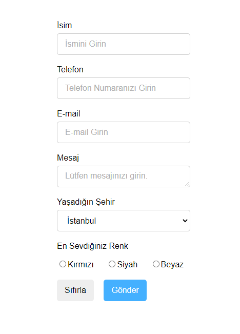

# Hafta 2

**Amaç :** ***Position*** yapısı nedir? ***Flex*** yapısı nedir? ***Form*** yapısı nedir?   Bu hafta bu konulardan bahsedeceğiz ve bunlarla ilgili örnekler yapacağız.

**Yazarlar :** [**altaysimsek**](https://github.com/altaysimsek) **&&** [**ufukcankurt**](https://github.com/ufukcankurt)

## Position Property Nedir?
Position özelliği, bir öğe için kullanılan konumlandırma yönteminin türünü belirtir (static, relative, fixed, absolute or sticky).

**Beş farklı position değeri vardır:**
- relative
- absolute
- fixed
- static
- sticky

Position özelliğini, elementlerimize "top, right, bottom, left" özelliklerini vermek için kullanırız. Position kullanmadan, bu özellikleri vermemiz mümkün değildir. Üstelik kullandığımız position'ın  türüne göre, verdiğimiz değerler farklı çalışacaktır.

## Flexbox Nedir?

## Form Yapısı Nedir? 

   

	

