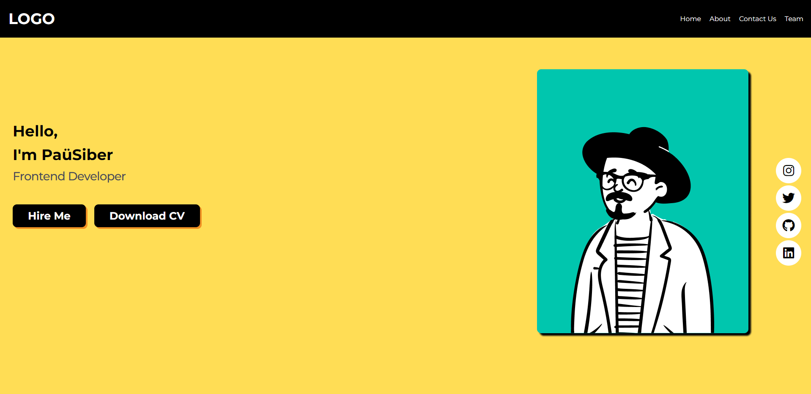

# Workshop

**Amaç :** Öğrendiklerimizin neredeyse tamamını kullanarak basit bir portfolyo site tasarımı hazırladık

**Yazarlar :** [**altaysimsek**](https://github.com/altaysimsek) **&&** [**ufukcankurt**](https://github.com/ufukcankurt) **&&** [**sezgialtan**](https://github.com/Szqii)

## Portfolyo Tasarımı

	

