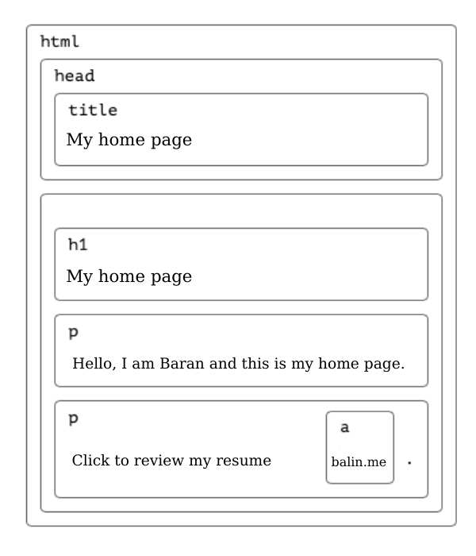

# DOM NEDİR

Document Object Model (DOM), programların ve komut dosyalarının bir belgenin içeriğine, yapısına ve stiline dinamik olarak erişmesine ve bunları güncellemesine olanak tanıyan platformdan ve dilden bağımsız bir arabirimdir.

DOM, bilgisayarınızın bir web sitesinin farklı bölümlerini ve bunların nasıl bir araya getirildiğini anlamasına yardımcı olur.

	

# DOM + JavaScript

DOM ve JavaScript birlikte web sitesinin canlanmasını ve farenizi hareket ettirmek veya bir düğmeye tıklamak gibi yaptığınız şeylere yanıt vermesini sağlar.

Özetle, DOM her şeyin nerede olduğunu gösteren bir harita gibidir ve JavaScript de bu haritadaki şeyleri değiştirebilen sihirli bir değnek gibidir.

# HTML DOM Nesne Ağacı

Web sitesinin her bir parçası "öğe" olarak adlandırılır ve bu öğeler ağaç benzeri bir yapıda düzenlenir.

	

Ağacın tepesi "kök" olarak adlandırılır ve tüm web sitesini temsil eder. Buradan itibaren ağaç, web sitesinin tamamını oluşturan başlıklar, paragraflar, resimler ve diğerleri gibi farklı bölümlere ayrılır.
DOM, bilgisayarların bir web sitesindeki belirli öğeleri bulmasına yardımcı olur. Buna ek olarak, geliştiricilerin bu öğelere erişmesine ve bunları değiştirmesine olanak tanır, böylece web sitesini etkileşimli hale getirebilirler.

# DOM'a Nasıl Erişilir?

DOM'daki öğelere erişmek, bir web sitesinin belirli bölümlerini bulmak ve bunları değiştirmek veya manipüle etmek anlamına gelir.

JavaScript, DOM'daki öğelere erişmek için getElementById, getElementsByTagName, querySelector ve querySelectorAll gibi farklı yöntemler sağlar.

Bu yöntemler, bir öğeyi id, tagname veya class adına göre bulmanıza ve manipülasyon için seçmenize olanak tanır.
