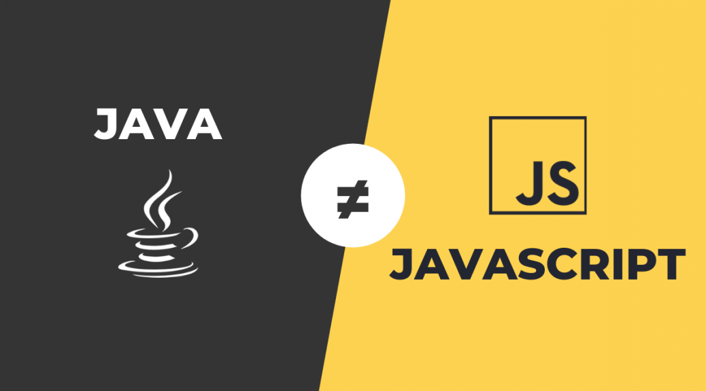
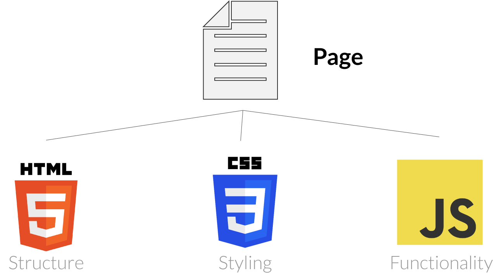
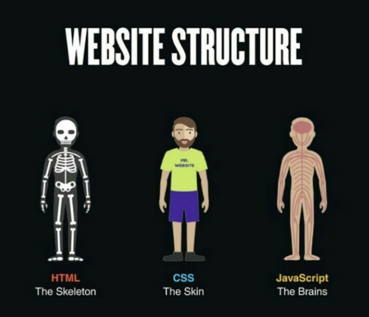
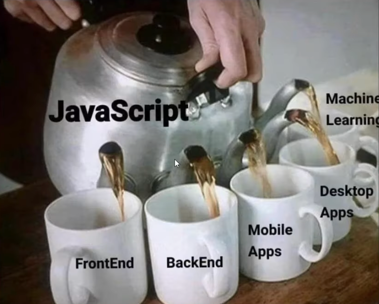
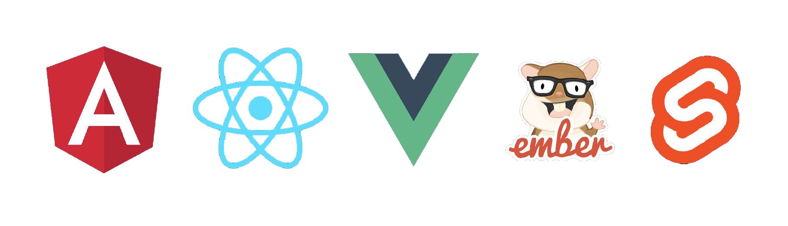
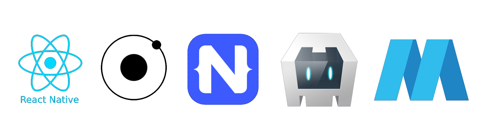

# Hafta 1

**Yazarlar :** [**semaozkan**](https://github.com/semaozkan) && [**isinnurgunay**](https://github.com/isinnur) && [**sametaydinhan**](https://github.com/sametAydinhan)

---

 <h1 align="center" >JAVASCRIPT 101</h1>

# JavaScript Ve Java'nın Farkı

<p align="center">
	
</p>

- JavaScript ve Java arasında; isimleri, yazım şekli ve standart kütüphanelerindeki benzerlikler dışında bir bağlantı yoktur ve iki dilin **semantikleri** çok farklıdır.
- Java, genel amaçlı bir programlama diliyken, JavaScript özellikle web tarayıcıları için etkileşimli web sayfaları oluşturmak için kullanılır.
  <br><br>

# JavaScript Nedir?

- JavaScript, web geliştirme için kullanılan bir programlama dilidir.
- JavaScript asenkron bir yapıya sahiptir. Asenkron programlama, kodun aynı sırayla çalışmasını beklemek yerine belirli işlemlerin eşzamanlı olarak gerçekleşmesini sağlama yöntemidir.
- Bu dil, web tarayıcıları tarafından desteklenen ve istemci tarafı **(client-side)** programlamada yaygın olarak kullanılan bir dildir.
- JavaScript, web sayfalarının etkileşimli hale gelmesini, dinamik içerik oluşturulmasını ve kullanıcıların web siteleriyle etkileşimde bulunmasını sağlar.JavaScript, basitçe HTML ve CSS ile birlikte kullanılarak web sayfalarının işlevselliğini artırabilir.
- HTML ve CSS ile JavaScript, World Wide Web'in (kısaca WWW veya Web) **temel üç öğesinden** biridir.
<br>
<p align="center">
	
</p>
Aşağıda yer alan görseldeki gibi HTML bir web sitesinin iskeletini yani ana yapısını oluşturmakta, CSS bu ana yapıya görsellik ve şekil vermekte, JavaScript ise yapının fonksiyonel olarak çalışmasını sağlamaktadır.
<br><br>
<p align="center">
	
</p>

## JavaScript'in kullanılabileceği alanlar:

<div style="display:flex; align-items:center">

- Front-end
- Back-end
- Mobil (Mobile)
- Masaüstü (Desktop)
- Oyun (Game)
- Makine Öğrenmesi, Derin Öğrenme ve Yapay Zeka

<p style="margin-left:200px">
	
</p>
</div>

### Front-End Alanında JavaScript

JavaScript, Front-end tarafında ilk yıllarında olduğu gibi yalın olarak bir diğer ismiyle **Vanilla JavaScript** olarak kullanabildiği gibi geliştirilen birçok farklı kütüphane (library) ve çatı (framework) ile de kullanabilmektedir.

En çok kullanılan JavaScript Front-end teknolojileri aşağıdaki görselde yer almaktadır.Bunlar soldan sağa doğru; Angular, React, Vue, Ember ve Svelte'dir.

<p align="center">
	
</p>

### Back-End Alanında JavaScript

JavaScript, geleneksel olarak web tarayıcıları için ön yüz geliştirmek için kullanılan bir dil olmasına rağmen, son yıllarda sunucu tarafı uygulamalar için de kullanılmaya başlanmıştır.

<p align="center">
	
</p>

### Mobil (Mobile) Alanında JavaScript

En çok kullanılan JavaScript mobil teknolojileri aşağıdaki görselde yer almaktadır. Bunlar soldan sağa doğru; React Native, Ionic, NativeScript, Cordova ve Mobile Angular UI'dır. <br>

<p align="center">
	
</p>

## ES6

ECMAScript 6 (ES6) veya daha yaygın olarak bilinen JavaScript'in altıncı sürümü, JavaScript'in temel dilini geliştiren ve yeni özellikler ekleyen bir sürümdür. ES6'da eklenen bazı önemli özellikler:

- let ve const: let ve const anahtar kelimeleri ile blok bağlamında (block-scoped) değişkenler tanımlanabilir. Bu, var ile ilgili sorunların düzeltilmesine yardımcı olur.
- Arrow function: Ok işaretli fonksiyonlar (arrow functions) daha kısa ve anlaşılır bir sözdizim sunar.

> ES5

```JAVASCRIPT
 function add(a,b){
  return a+b;
 }
```

> ES6

```JAVASCRIPT
 const add= () => a+b;

```

- Yeniden Atama Operatörleri(+=, -=, \*=, /=, ve \*\*=)

- Şablon Dizeleri (Template Strings): Şablon dizeleri ile metinleri daha kolay bir şekilde birleştirebilirsiniz.

```JAVASCRIPT
const name = "Ahmet";
const age = 30;

const greeting = `Merhaba, benim adım ${name} ve ben ${age} yaşındayım.`;

console.log(greeting);
```

## Değişken Tanımlama

### 1. var

- Değişken değerleri değiştirilebilir.
- Aynı isimle tekrardan tanımlanabilirler.
- Tanımlı olduğu fonksiyon içinde erişilebilirler.

### 2. let

- Değişken değerleri değiştirilebilir.
- Aynı isimle tekrardan aynı blokta tanımlanamaz. Farklı block'larda aynı isimle tanımlanabilir.
- let ile tanımlanan değişkenler tanımlandığı blok içinde geçerli olur.

```JAVASCRIPT
if(true){
  let x=5;
}
console.log(x); // ERROR: x is not defined
```

### 3. const

- Const ile tanımlanan değişkenler, sabit bir değere sahiptir ve bu değer değiştirilemez.
